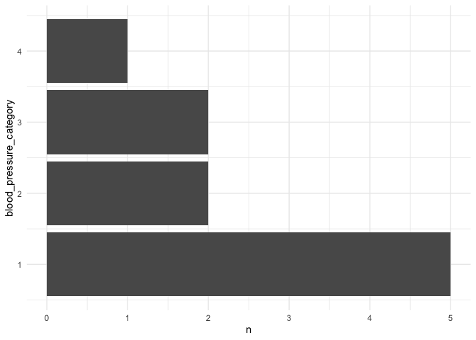
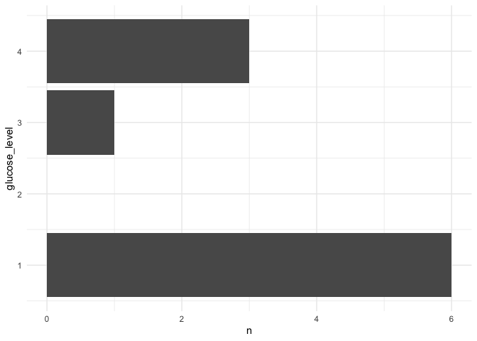
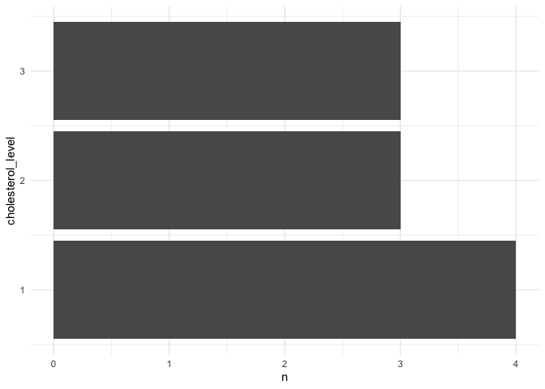
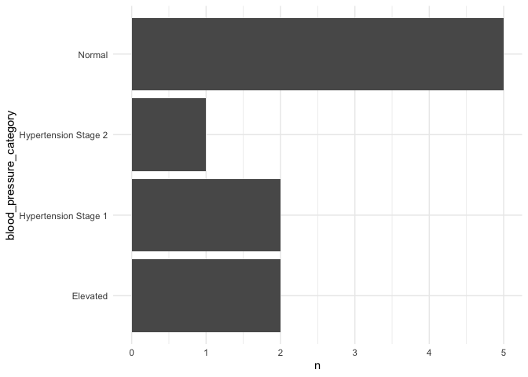
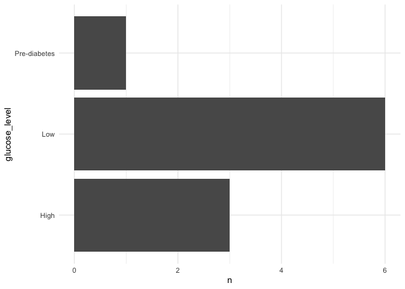
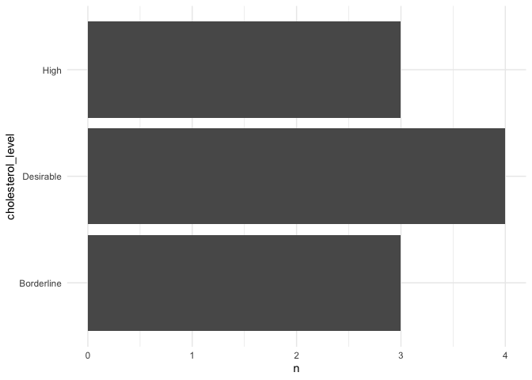

<!-- README.md is generated from README.Rmd. Please edit that file -->

# CohortLabeleR 

<!-- badges: start -->

[](https://lifecycle.r-lib.org/articles/stages.html#experimental)
<!-- badges: end -->

CohortLabeleR provides functions to easily add STATA-style variable and
cell labels to entire data frames in R. It also includes tools for quick
variable recoding, making it easier to work with categorical numeric
variables commonly found in longitudinal cohort studies.

## Introduction

Longitudinal or cohort studies are used to understand human health and
how social and environmental factors influence it. These studies follow
individuals over time across different cohorts, collecting data of
interest from surveys and/or biological or environmental measurements.

In terms of databases, these studies are usually reported with one file
per cohort, accompanied by a dictionary that helps interpret the
variables measured in each case. Although many variables are included
(sometimes more than 200 per cohort), these datasets rarely exceed one
gigabyte. The variables are often a mix of survey responses coded as
integers in categorical variables and numeric values from biological
measurements.

Performing a thorough exploratory data analysis (EDA) of these datasets
can be challenging due to the large number of variables. Therefore,
using programming languages like R, which can automatize data analysis
easily, opens up additional possibilities for EDA. **CohortLabeleR** is
an R package with three functions that simplifies processing of
categorical variables coded as numbers and also enables data transfer to
STATA without loss of information.

The first function, `recode_vars()`, allows you to replace numerical
codes in categorical variables with text throughout the dataset. This
not only enables data interpretation without repeatedly consulting the
dictionary for each variable but also improves the interpretability of
plots. This is particularly useful if you want to create automatically
plots for each variable in the dataset for a first analysis of the data.

The `replace_missing_with_na()` function replaces missing values with
`NA`. This facilitates the visualization of missing values, that are
usually coded in more than one level in the categorical numerical
variables.

Finally, `label_df_for_STATA()` adds labels to variable names and
numeric values in categorical variables in a format that STATA can open
directly, preserving information in the case of switching to STATA.

## Installation

You can install the development version of CohortLabeleR from
[GitHub](https://github.com/) with:

``` r
# install.packages("devtools")
devtools::install_github("StringhiniLab/CohortLabeleR")
```

## Use

This package consists of three functions.

### 1. `recode_vars()`

Many datasets, such as CLSA, use numeric codes for categorical
variables. This can make it harder to label axes when you want to
produce many plots or to interpret the data at a glance. This function
replaces all numeric category values in the data frame with their
corresponding labels, making the data easier to read and visualize. For
example, if we want to plot the last three variables of this dataset:

``` r
library(CohortLabeleR)
library(dplyr)
library(ggplot2)
library(purrr)
head(df)
#>   id gender age blood_pressure_category glucose_level cholesterol_level
#> 1  1   Male  25                       1             1                 1
#> 2  2 Female  30                       2             4                 3
#> 3  3   Male  22                       1             1                 1
#> 4  4   Male  35                       3             3                 2
#> 5  5 Female  40                       1             1                 3
#> 6  6   Male  28                       4             4                 2
```

``` r

# Function for plotting
barplot <- function(var, data = df){
data |> 
count(!!sym(var)) |> 
ggplot(aes(x = !!sym(var), y = n)) +
  geom_col() + 
  coord_flip() +
  theme_minimal()
}

# I create plots for three variables
purrr::map(colnames(df)[4:6], barplot)
#> [[1]]
```



    #> 
    #> [[2]]



    #> 
    #> [[3]]


The category levels of each variable are not possible to recognize. To
fix this, you can use `recode_vars` to replace the labels directly,
using the dictionary as a reference.

``` r
# dictionary
head(dict_df)
#>                  variable level_num            level_str
#> 1 blood_pressure_category         1               Normal
#> 2 blood_pressure_category         2             Elevated
#> 3 blood_pressure_category         3 Hypertension Stage 1
#> 4 blood_pressure_category         4 Hypertension Stage 2
#> 5           glucose_level         1                  Low
#> 6           glucose_level         2               Normal

# recoding the variables
df_recoded <- recode_vars(data = df,
            # specify here other numeric columns you would like to ignore
            ignore_columns = c(id, age), 
            dictionary = dict_df,
            # dictionary column with the variable names
            var_colname = variable, # dictionary column with the variables
            # dictionary column with the category numbers
            num_colname = level_num,
            # dictionary column with the category labels
            str_colname = level_str)
head(df_recoded)
#>   id gender age blood_pressure_category glucose_level cholesterol_level
#> 1  1   Male  25                  Normal           Low         Desirable
#> 2  2 Female  30                Elevated          High              High
#> 3  3   Male  22                  Normal           Low         Desirable
#> 4  4   Male  35    Hypertension Stage 1  Pre-diabetes        Borderline
#> 5  5 Female  40                  Normal           Low              High
#> 6  6   Male  28    Hypertension Stage 2          High        Borderline
```

``` r
purrr::map(data = df_recoded, colnames(df_recoded)[4:6], barplot)
#> [[1]]
```



    #> 
    #> [[2]]



    #> 
    #> [[3]]



### 2. `replace_missing_with_na()`

This function reads the dictionary and detects observations that are
coded as missing. These missing values are represented numerically, with
values like -99, which are clearly not valid results.

Databases such as CLSA, encode these missing values distinguishing the
reasons for the missing data and assigning different numeric codes to
each case. It is not the same to say that the person preferred not to
answer the survey as it is to say that the survey was never conducted.
This means that there are many numeric codes that can represent a
missing value.

The goal of this function is to convert all of the missing values of the
categorical variables coded as numbers of a data frame to `NA`. This
makes it much easier to detect the total amount of missing data per
variable, regardless of the origin of the missing values.

``` r
# There are missing values in blood_pressure_category and cholesterol_level
df_missing
#>    id gender age blood_pressure_category glucose_level cholesterol_level
#> 1   1   Male  25                       1             1                 1
#> 2   2 Female  30                       2             4                 3
#> 3   3   Male  22                       1             2             -9999
#> 4   4   Male  35                       3             3                 2
#> 5   5 Female  40                       1             1                 3
#> 6   6   Male  28                       4             4                 2
#> 7   7 Female  32                       1             1                 1
#> 8   8   Male  27                       2             1                 1
#> 9   9 Female  45                   -9999             4                 3
#> 10 10   Male  29                       1             1             -8888
```

``` r
df_missing_NA <- replace_missing_with_na(dataset = df_missing,
                         ignore_columns = c(id, age),
                         dictionary = dict_df_missing,
                         var_colname = variable,
                         num_colname = level_num,
                         missing_colname = missing)

df_missing_NA
#>    id gender age blood_pressure_category glucose_level cholesterol_level
#> 1   1   Male  25                       1             1                 1
#> 2   2 Female  30                       2             4                 3
#> 3   3   Male  22                       1             2                NA
#> 4   4   Male  35                       3             3                 2
#> 5   5 Female  40                       1             1                 3
#> 6   6   Male  28                       4             4                 2
#> 7   7 Female  32                       1             1                 1
#> 8   8   Male  27                       2             1                 1
#> 9   9 Female  45                      NA             4                 3
#> 10 10   Male  29                       1             1                NA
```

Now, let’s estimate the percentage of data that is missing.

``` r
# 2 of 10 observations are missing for cholesterol_level (20%)
# 1 of 10 observations are missing for blood_pressure_category (10%)
colMeans(is.na.data.frame(df_missing_NA))*100
#>                      id                  gender                     age 
#>                       0                       0                       0 
#> blood_pressure_category           glucose_level       cholesterol_level 
#>                      10                       0                      20
```

### 3. `label_df_for_STATA()`

To open a database in a format compatible with STATA, it is advisable
that:

1.  **The variables have labels**.  
    This allows information that is typically not encoded in the
    variable name, such as units or more detailed human readable text,
    to be associated with each data column.

2.  **The numeric values of categorical variables have labels**.  
    For variables reported as categorical and coded as numbers, it is
    possible to assign labels. This way, it is easy to visualize what
    each category level represents in STATA.

The function `label_df_for_STATA()` reads the data frame and the
provided dictionary, and adds a variable label to all column names, as
well as a label to all numeric variables reported as categorical. It is
possible to exclude those numeric variables without levels using the
`ignore_columns` argument.

In this way, the data frame can be saved as a `.dta` file and easily
opened in STATA with all the important information needed for the
analysis.

``` r
df_stata <- label_df_for_STATA(dataset = df,
                   dictionary = dict_df_var_label,
                   ignore_columns = c("id", "age"),
                   var_label = var_label , # variable label
                   var_colname = variable, # variable colname
                   num_colname = level_num, # code number
                   str_colname = level_str) # code label

# You can recognize the variable labels (as attributes) and code labels (as labels) when checking the data frame structure
str(df_stata)
#> 'data.frame':    10 obs. of  6 variables:
#>  $ id                     : int  1 2 3 4 5 6 7 8 9 10
#>   ..- attr(*, "label")= chr "Patient Id"
#>  $ gender                 : Factor w/ 2 levels "Male","Female": 1 2 1 1 2 1 2 1 2 1
#>   ..- attr(*, "label")= chr "Gender"
#>  $ age                    : num  25 30 22 35 40 28 32 27 45 29
#>   ..- attr(*, "label")= chr "Age (years)"
#>  $ blood_pressure_category: dbl+lbl [1:10] 1, 1, 1, 1, 1, 1, 1, 1, 1, 1
#>    ..@ labels: Named num  1 2 3 4
#>    .. ..- attr(*, "names")= chr [1:4] "Normal" "Elevated" "Hypertension Stage 1" "Hypertension Stage 2"
#>    ..@ label : chr "Blood pressure"
#>  $ glucose_level          : dbl+lbl [1:10] 1, 1, 1, 1, 1, 1, 1, 1, 1, 1
#>    ..@ labels: Named num  1 2 3 4
#>    .. ..- attr(*, "names")= chr [1:4] "Low" "Normal" "Pre-diabetes" "High"
#>    ..@ label : chr "Glucose Level"
#>  $ cholesterol_level      : dbl+lbl [1:10] 1, 1, 1, 1, 1, 1, 1, 1, 1, 1
#>    ..@ labels: Named num  1 2 3
#>    .. ..- attr(*, "names")= chr [1:3] "Desirable" "Borderline" "High"
#>    ..@ label : chr "Cholesterol Level"
```

Finally, you can save the file using the `haven` package:

``` r
# save the file in STATA format
haven::write_dta(df_stata, "data/2020-11-04_df_stata.dta")
```
